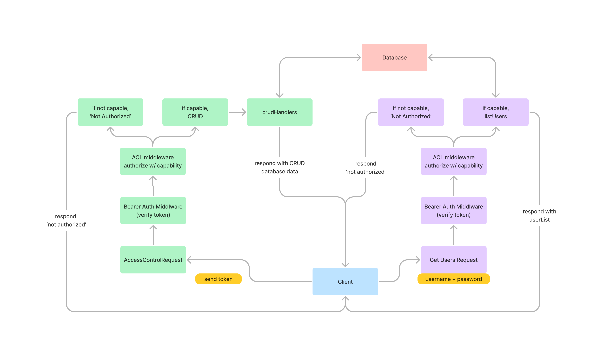

# LAB - IMS API - 401 Class 09

Lab 09 Inventory Management System - build your own api project

## Project: Inventory Management System

Backend API for managing inventory items in a store or warehouse.

### Author: Melo

### Problem Domain

Objective: Build a backend API implementing a fully functional, authenticated and authorized API Server demonstrating CRUD operations with Role-Based Access Control (RBAC) to ensure different levels of access for Stock Clerks, Managers, and Auditors.

### Links and Resources

- [Pull Request](https://github.com/MelodicXP/ims-api/pulls)
- [GitHub Actions ci/cd](https://github.com/MelodicXP/ims-api/actions)
- Prod [back-end server url](https://ims-api-lab09.onrender.com/)

### Collaborators

### Setup

#### `.env` requirements (where applicable)

DATABASE_URL: postgres://localhost:XXXX/name-of-server
SECRET=secretOfChoice

#### How to initialize/run your application (where applicable)

- e.g. `npm start`

#### How to use your library (where applicable)

#### Features / Routes

- Feature One: Deploy as prod branch once all tests pass.

#### Tests

- How do you run tests?
  - jest and supertest

- Any tests of note?
  - 404 on a bad route
  - 404 on a bad method
  - POST to /signup to create a new user.
  - POST to /signin to login as a user (use basic auth).
  - Tests for auth middleware and routes.

- AUTH Routes:
  - POST /signup creates a new user and sends an object with the user and the token to the client.
  - POST /signin with basic authentication headers logs in a user and sends an object with the user and the token to the client.

- V1 (Authenticated API) routes:
  - POST /api/v2/:model with a bearer token that has create permissions adds an item to the DB and returns an object with the added item.
  - GET /api/v2/:model with a bearer token that has read permissions returns a list of :model items.
  - GET /api/v2/:model/ID with a bearer token that has read permissions returns a single item by ID.
  - PUT /api/v2/:model/ID with a bearer token that has update permissions returns a single, updated item by ID.
  - DELETE /api/v2/:model/ID with a bearer token that has delete permissions returns an empty object. Subsequent GET for the same ID should result in nothing found.

#### UML

#### File Structure

